# Diagram Recipes

Complete, styled, copy-adaptable examples. Init directives are shown joined on one line exactly as they should be pasted. Contents:

- Flowchart (decision flow)
- Architecture (subgraph lanes)
- Sequence (alt/else, activation, note)
- ER (keys and crow's foot)
- UML Class
- State
- Mindmap
- Timeline
- Gantt
- Quadrant chart
- Sankey (beta)
- XY chart (beta)

## Flowchart (decision flow)

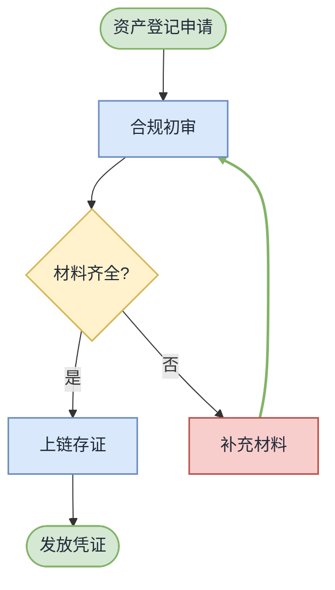

`linkStyle 4` highlights the happy-path edge to the terminal node. Count edges from 0 in definition order.

## Architecture (subgraph lanes)

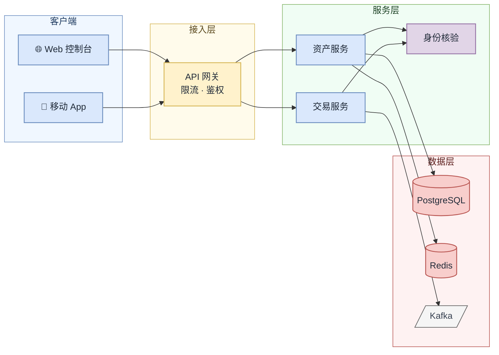

Lane order = reading order (left→right for LR). Keep inter-lane edges flowing one direction; a back-flow edge is a smell — check the semantic model.

## Sequence (alt/else, activation, note)

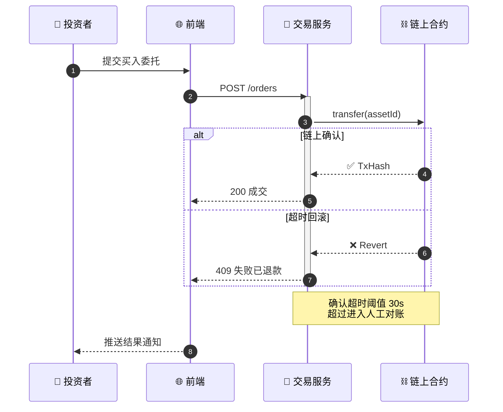

Sequence diagrams have no classDefs — styling lives entirely in themeVariables. Use `rect rgb(240,249,255) ... end` to shade a phase.

## ER (keys and crow's foot)

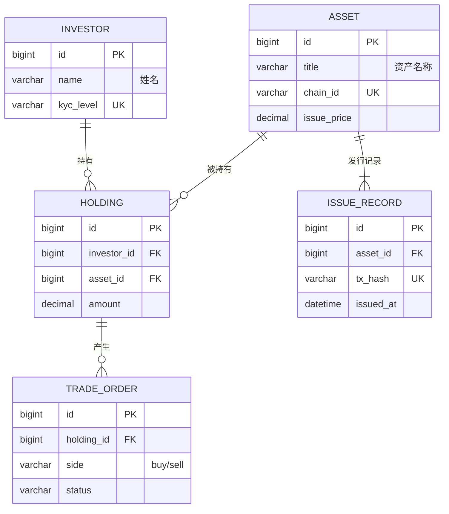

ER diagrams ignore classDefs — the value is correct cardinality (`||--o{`, `}o--o{`, `||--||`) and PK/FK/UK markers.

## UML Class

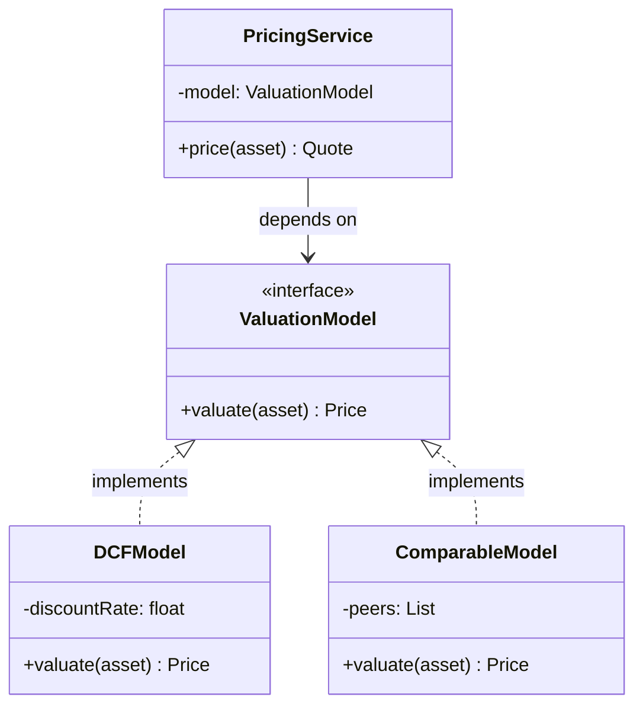

Relationship arrows: `<|--` inheritance, `<|..` realization, `-->` association, `--*` composition, `--o` aggregation, `..>` dependency.

## State

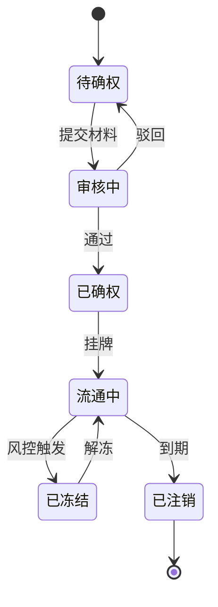

State names may be Chinese directly. Attach classes inline with `名称:::class` — the standalone `class 名称 className` statement only accepts ASCII ids (or declare `state "审核中" as REVIEW` and use `class REVIEW warn`). Composite states: `state 审核中 { [*] --> 自动校验 }`.

## Mindmap

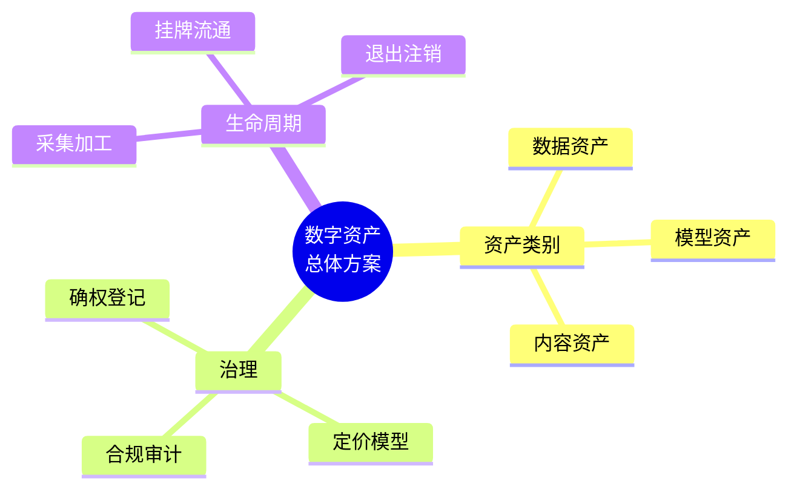

Mindmap theming is limited — rely on structure and concise wording. `root((...))` circle, `))...((` bang, `{{...}}` hexagon.

## Timeline

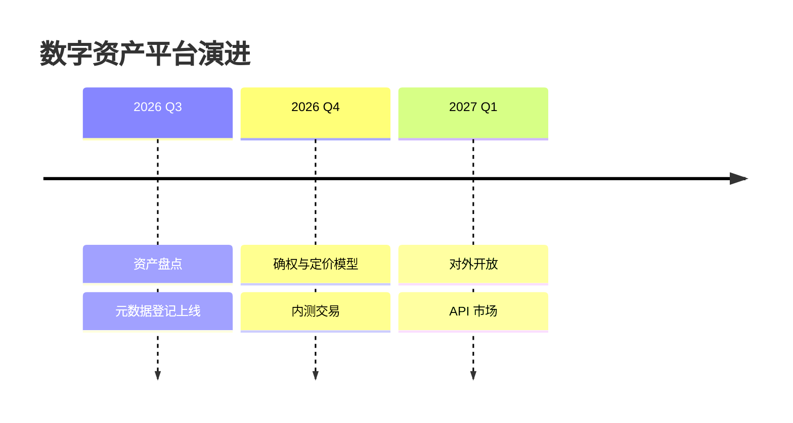

## Gantt

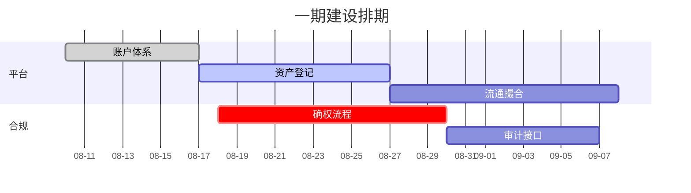

## Quadrant chart

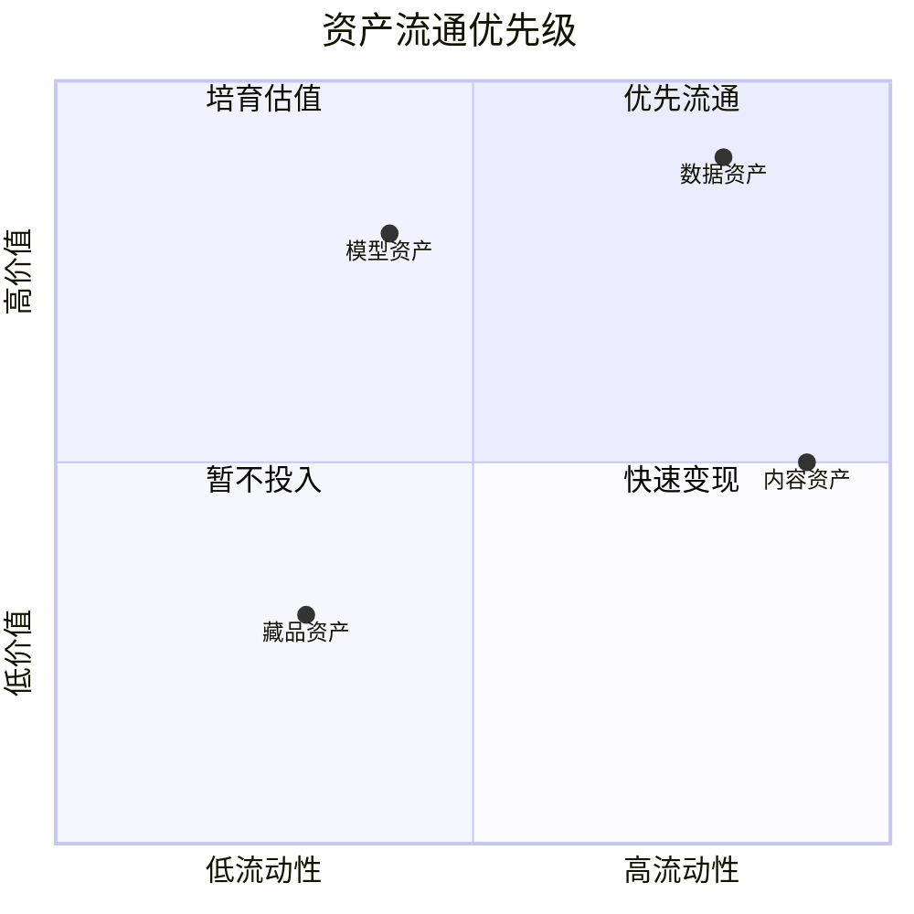

## Sankey (beta)

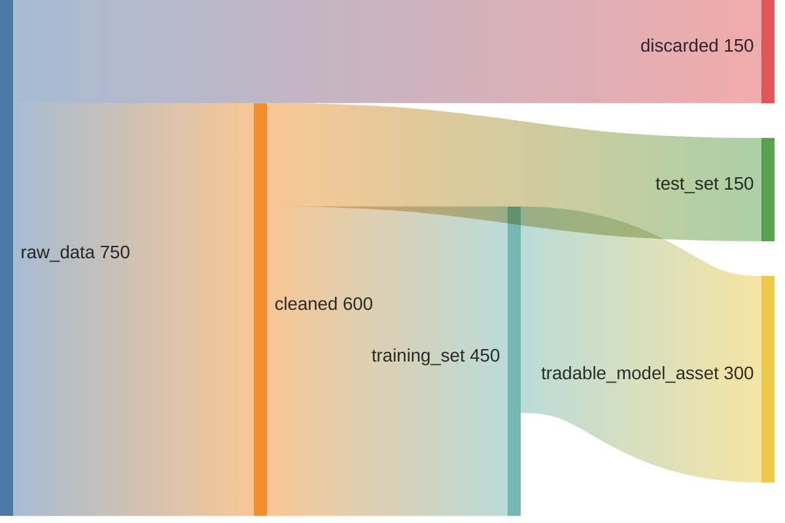

sankey-beta accepts only ASCII labels (no CJK, no quotes) — use English or pinyin and put the Chinese explanation in the surrounding prose.

## XY chart (beta)

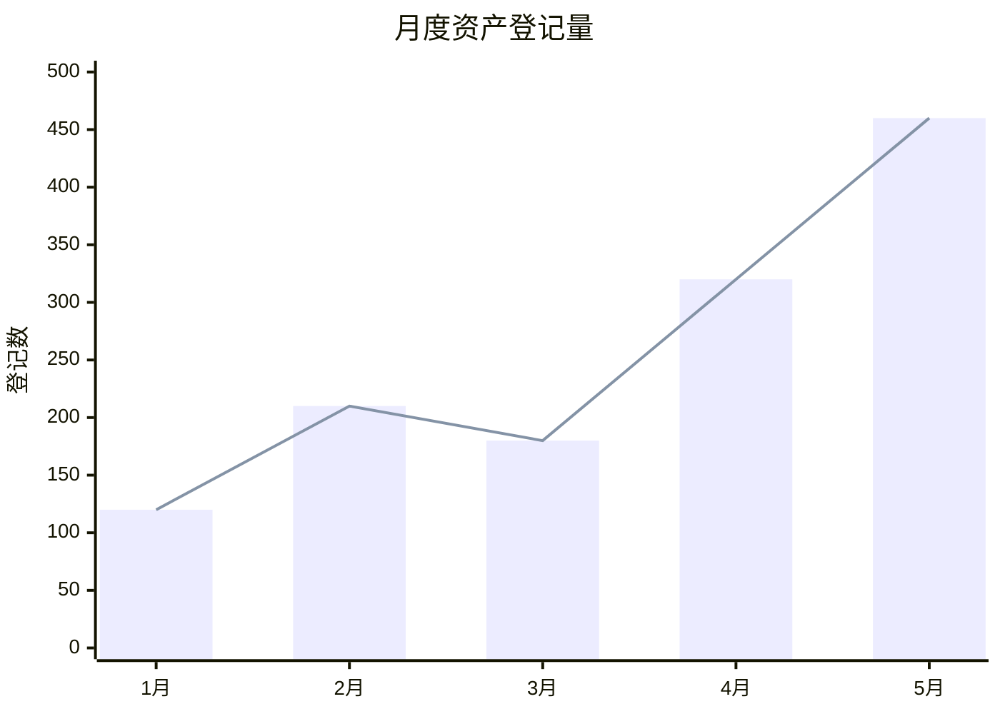
